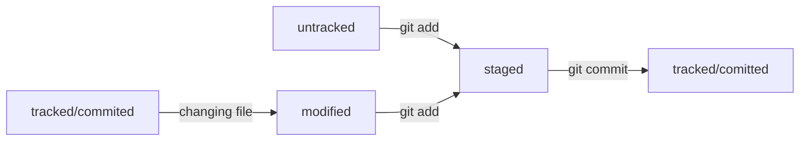

## Сделать папку репозиторием — git init

## «Разгитить» папку, если что-то пошло не так, — rm -rf .git

Разберём подробнее, что такое -rf:  
    ключ -r (от англ. recursive — «рекурсивно») позволяет удалять папки вместе с их содержимым;  
    ключ -f (от англ. force — «заставить») избавит вас от вопросов вроде «Вы точно хотите удалить этот файл? А этот? И этот тоже?».  

## Проверить состояние репозитория — git status

## Подготовить файлы к сохранению — git add

    $ git add --all  
    $ git add . # добавить всю текущую папку 

## Выполнить коммит — git commit

    $ git commit -m 'Мой первый коммит!'  

## Просмотреть историю коммитов — git log

## Получить сокращённый лог — git log --oneline

## Что такое GitHub

GitHub — платформа для хранения IT-проектов и совместной работы над ними с использованием Git.  
По сути, это сайт, куда можно загрузить файлы своего проекта для обмена с другими людьми.  

## Что такое SSH

Когда компьютеры обмениваются данными в сети, они следуют сетевым протоколам  
(англ. network protocols) — правилам обмена данными между компьютерами.  
Один из наиболее распространённых сетевых протоколов — SSH (от англ. Secure Shell Protocol).  
Он обеспечивает безопасный обмен данными в сети. С помощью этого протокола можно получать данные с удалённого компьютера или отправлять их на него.  
Трафик шифруется, поэтому протокол безопасен.  
SSH использует пару ключей для обеспечения безопасности — публичный и приватный:  

* Приватный ключ (англ. private key) хранится только на вашем компьютере и не должен передаваться кому-либо ещё. Он используется для расшифровки данных.

* Публичный ключ (англ. public key) доступен всем и используется для шифрования данных. Они могут быть расшифрованы парным приватным ключом.
  Инструкция по связыванию SSH-ключа и GitHub-аккаунта:  
1. После выполнения команды ssh-keygen из предыдущего урока в директории ~/.ssh будет создано два файла — id_ed25519 и id_ed25519.pub (или id_rsa и id_rsa.pub — в зависимости от того, какой алгоритм вы использовали):
   
   * id_ed25519/id_rsa — приватный ключ (файл без .pub в конце). Ни в коем случае не копируйте его и не делитесь им.
   * id_ed25519.pub/id_rsa.pub — публичный ключ (на это указывает расширение .pub).
     Скопируйте содержимое файла с публичным ключом в буфер обмена. ($ clip < ~/.ssh/id_ed25519.pub )

2. Перейдите на GitHub и выберите пункт Settings (англ. «настройки») в меню аккаунта.

3. В меню слева нажмите на пункт SSH and GPG keys.

4. В открывшейся вкладке выберите New SSH key (англ. «новый SSH-ключ»).

5. В поле Title (англ. «заголовок») напишите название ключа. Например, Personal key (англ. «личный ключ»).

6. В поле Key type (англ. «тип ключа») должно быть Authentication Key (англ. «ключ аутентификации»).

7. В поле Key скопируйте ваш ключ из буфера обмена.

8. Нажмите на кнопку Add SSH key (англ. «добавить SSH-ключ»).

9. Проверьте правильность ключа с помощью следующей команды. ($ ssh -T git@github.com) Если это первый раз, когда вы используете Git, чтобы поделиться проектом на GitHub, появится похожее предупреждение. The authenticity of host 'github.com (140.82.121.4)' can't be established. ED25519 key fingerprint is SHA256:+DiY3wvvV6TuJJhbpZisF/zLDA0zPMSvHdkr4UvCOqU. This key is not known by any other names. Are you sure you want to continue connecting (yes/no/[fingerprint])? Это предупреждение сообщает, что вы никогда не соединялись с сервером GitHub. Поэтому Git не может гарантировать, что сервер является тем, за кого он себя выдаёт. Для подтверждения подлинности сервер генерирует и публикует ключи SHA256. Вы можете проверить ключи GitHub по этой ссылке. Если ключ в предупреждении совпадает с тем, что вы видите на сайте, значит, сервер является действительным. Введите yes, чтобы продолжить.  

## Привязать удалённый репозиторий к локальному — git remote add

## Убедиться, что репозитории связаны, — git remote -v

## Отправить изменения на удалённый репозиторий — git push

## [Про README файлы](https://github.com/GVarya/for_test)

## Хеш — идентификатор коммита

Git хеширует (преобразует) информацию о коммите с помощью алгоритма SHA-1 (от англ.  Secure Hash Algorithm — «безопасный алгоритм хеширования») и получает для каждого коммита свой уникальный хеш — результат хеширования.
**Хеш — основной идентификатор коммита**
Git хранит таблицу соответствий хеш → информация о коммите. Если вы знаете хеш, вы можете узнать всё остальное: автора и дату коммита и содержимое закоммиченных файлов. Можно сказать, что хеш — основной идентификатор коммита.

## Получить сокращённый лог — git log --oneline

Получить сокращённый лог можно с помощью команды git log с флагом --oneline (англ. «одной строкой»). В терминале появятся только первые несколько символов хеша каждого коммита и их комментарии.

Обратите внимание: если выход из просмотра логов не произошёл автоматически, нажмите  клавишу Q (от англ. Quit — «выйти») в английской раскладке клавиатуры.

## Файл HEAD

Файл HEAD (англ. «голова», «головной») — один из служебных файлов папки .git.  
Он указывает на коммит, который сделан последним (то есть на самый новый).

## Статусы untracked/tracked, staged и modified

Одна из ключевых задач Git — отслеживать изменения файлов в репозитории. Для этого каждый файл помечается каким-либо статусом. Рассмотрим основные.  

* untracked (англ. «неотслеживаемый») Мы говорили, что новые файлы в Git-репозитории помечаются как untracked, то есть неотслеживаемые. Git «видит», что такой файл существует, но не следит за изменениями в нём. У untracked-файла нет предыдущих версий, зафиксированных в коммитах или через команду git add.
* staged (англ. «подготовленный») После выполнения команды git add файл попадает в staging area (от англ. stage — «сцена», «этап [процесса]» и area — «область»), то есть в список файлов, которые войдут в коммит. В этот момент файл находится в состоянии staged.
* tracked (англ. «отслеживаемый») Состояние tracked — это противоположность untracked. Оно довольно широкое по смыслу: в него попадают файлы, которые уже были зафиксированы с помощью git commit, а также файлы, которые были добавлены в staging area командой git add. То есть все файлы, в которых Git так или иначе отслеживает изменения.
* modified (англ. «изменённый») Состояние modified означает, что Git сравнил содержимое файла с последней сохранённой версией и нашёл отличия. Например, файл был закоммичен и после этого изменён.  

